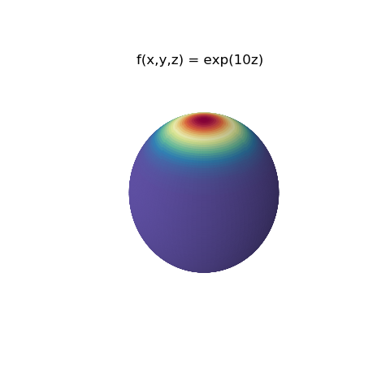
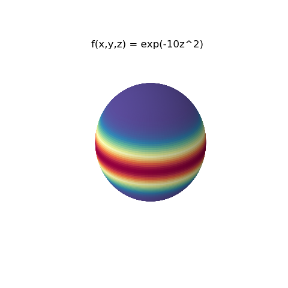

# sphericalquadpy 

[](https://circleci.com/gh/camminady/sphericalquadpy/tree/master)
[](https://travis-ci.com/camminady/sphericalquadpy)
[](https://codecov.io/gh/camminady/sphericalquadpy)

**This package is still in a very early development stage!**


Quadrature sets for spherical integration on the unit sphere in three dimensions.

A spherical quadrature is used to approximate the integral of a function 


```text
∫ f(x,y,z) dΩ  ≈ ∑ f(xₖ, yₖ, zₖ) wₖ
```

Where the function lives on the unit sphere and maps to the real numbers.

The aim of this package is to provide different sets of quadrature points and 
related quadrature weights to evaluate spherical integral for different 
functions. 

## Available quadratures

- Gauss Legendre quadrature 
    - uses `numpy.polynomial.legendre.leggauss` in polar angle, equidistant in 
    azimuthal angle
    - implemented in `gausslegendre.gausslegendre.GaussLegendre`

- LDFESA quadrature **(use with caution, in beta)**
    - generated from a lookup table and available for order 1,2 and 3.
    - implemented in `ldfesa.ldfesa.LDFESA`
    - taken from the appendix of [this paper by J. J. Jarrell and M. L. Adams](https://inis.iaea.org/collection/NCLCollectionStore/_Public/48/022/48022289.pdf)
    


- Level Symmetric quadrature **(use with caution, in beta)**
    - generated from a lookup table and available for order 2 to 20.
    - only single precision
    - implemented in `sphericalquadpy.levelsymmetric.Levelsymmetric`
    - taken from [this source](http://tflaspoehler.com/ordinates.html)

- Lebedev quadrature **(use with caution, in beta)**
    - generated from a lookup table and available for order 3 to 131.
    - only single precision
    - implemented in `sphericalquadpy.lebedev.Lebedev`
    - taken from [this source](http://people.sc.fsu.edu/~jburkardt/datasets/sphere_lebedev_rule/sphere_lebedev_rule.html)
    
- Random Points
    - uses random points on the unit sphere with equal weights
    - implemented in `sphericalquadpy.montecarlo.MonteCarlo`      

## How to use
We start by cloning the repository and changing into the directory
    
    git clone https://github.com/camminady/sphericalquadpy.git
    cd sphericalquadpy
    
Next, we start Python 3
    
    python

We import the module
    
    >>> import sphericalquadpy

Let us choose the Lebedev quadrature to integrate a function

    >>> Q = sphericalquadpy.lebedev.Lebedev(order = 7)

Import `numpy ` and define a function we want to integrate

    >>> from numpy import exp 
    >>> def f(x,y,z): return exp(-z**2)
 
Integrating `f` over the unit sphere approximately equals `9.38486877222642` which we compare
with the numerical integral

    >>> print(Q.integrate(f) - 9.38486877222642)
    0.002104867216667472

To get a more accurate value, we can increase the order of the quadrature. Alternatively,
we can specify the desired number of quadrature points. Since every quadrature as a different
relation between the order and the number of quadrature points, we can not guarantee to generate a 
quadrature that has exactly the required number of quadrature points. Internally, the order that 
yields the number of quadrature points that is closest to the desired number of quadrature points will be chosen.

    >>> Qfine = sphericalquadpy.lebedev.Lebedev(nq=200)
    >>> print(len(Qfine.weights))
    194

We generated a quadrature with 194 quadrature points which approximates the function `f` better 
than before

    >>> print(Qfine.integrate(f) - 9.38486877222642)
    6.444195754795601e-08


## Results
The figure below shows the convergence rate for different functions and the different
quadratures. One goal of spherical quadratures is for them to be isotropic. That is, randomly rotating
the quadrature set on the sphere should have little influence on the computation
of the integral. Thus, every integral was computed a hundred times with different
random rotations of the same original quadrature set. The mean and variance of the resulting
errors are shown in the figures below, together with the different functions.

| Function | Convergence |
| ------------- |:-------------:|
||  |

| Function | Convergence |
| ------------- |:-------------:|
|| |

| Function | Convergence |
| ------------- |:-------------:|
|||
 

## Implementation details
All implemented quadratures inherit from the abstract metaclass `Quadrature`. 
Any new implementation of a quadrature has to implement the following routines 
that are defined as `abstract` in `Quadrature`:


    def name(self):
        """Has to return a string with the name of the quadrature."""

    def getmaximalorder(self):
        """Returns the maximal order for which the quadrature is available.
        This can be inf for quadratures which we generate or some bounded value
        if the quadrature exists only as a lookup table."""
        
    def nqbyorder(self, order):
        """Specifies how the order relates to the number of quadrature points."""

    def computequadpoints(self, order):
        """Computes the quadrature points based on a given order. """

    def computequadweights(self, order):
        """Computes the quadrature weights based on a given order."""


    
The `Quadrature` class then provides the function `integrate` which integrates
any function that depends on three arguments numerically with the given 
quadrature.

## Todo

- Full precision for quadrature from look up table
- More quadratures
- Write to file routine
- Portfolio of testcases

## Credit
This work was inspired by the great collection of quadrature sets [quadpy](https://github.com/nschloe/quadpy) by [Nico Schlömer](https://github.com/nschloe). 
It was helpful not only for the quadrature sets themselves, but also for the demonstration of how to create a Python module.
